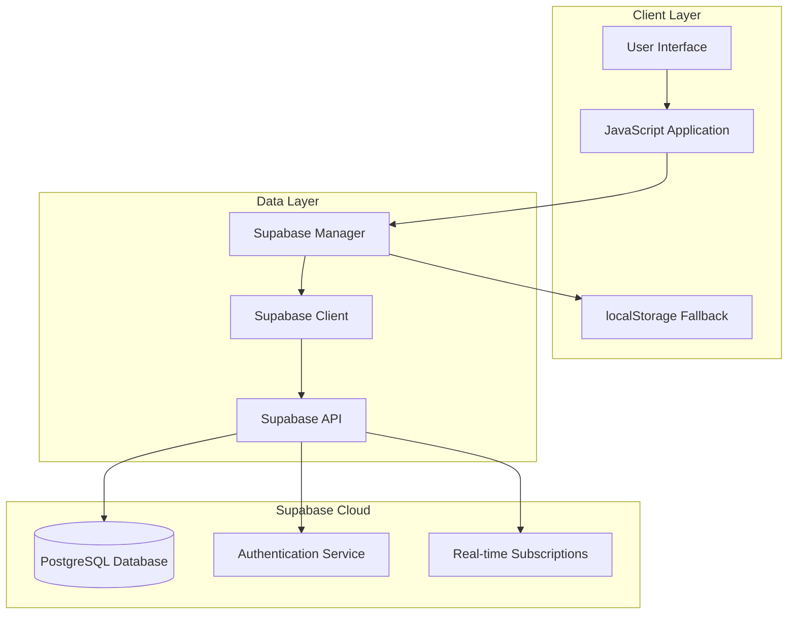
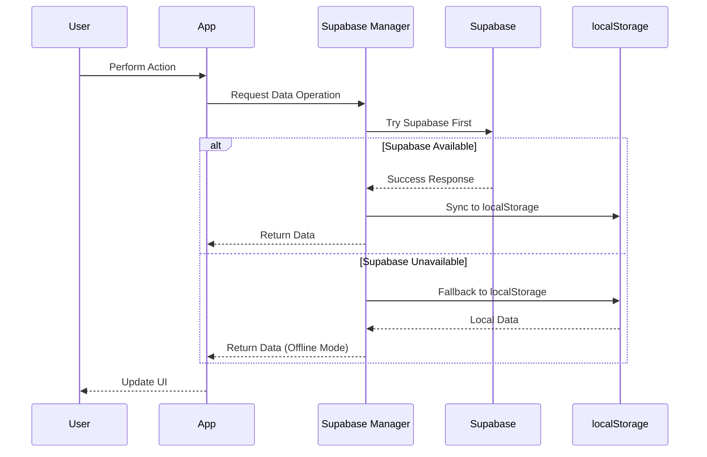

# Design Document - Supabase Integration

## Overview

This design implements a comprehensive Supabase integration for the warehouse management system, replacing localStorage with a cloud-based PostgreSQL database. The solution provides real-time data synchronization, user authentication, offline fallback capabilities, and seamless data migration from the existing localStorage implementation.

The architecture follows a progressive enhancement approach, maintaining backward compatibility while introducing robust cloud storage capabilities.

## Architecture

### High-Level Architecture



### Data Flow Architecture



## Components and Interfaces

### 1. Supabase Manager (Core Component)

**Purpose**: Central orchestrator for all database operations with fallback handling.

**Key Responsibilities**:
- Initialize Supabase client connection
- Handle authentication state management
- Provide unified API for CRUD operations
- Manage offline/online state transitions
- Coordinate data synchronization

**Interface**:
```javascript
class SupabaseManager {
    // Connection Management
    async initialize()
    async testConnection()
    isOnline()
    
    // Authentication
    async signUp(email, password)
    async signIn(email, password)
    async signOut()
    getCurrentUser()
    
    // Data Operations
    async create(table, data)
    async read(table, filters)
    async update(table, id, data)
    async delete(table, id)
    
    // Synchronization
    async syncToSupabase(localData)
    async syncFromSupabase()
    async migrateFromLocalStorage()
    
    // Real-time Subscriptions
    subscribe(table, callback)
    unsubscribe(subscription)
}
```

### 2. Data Access Layer

**Purpose**: Abstraction layer providing consistent data access regardless of storage backend.

**Components**:
- `DeliveryService`: Manages delivery records and status updates
- `CustomerService`: Handles customer and vendor data
- `UserService`: Manages user profiles and preferences
- `BookingService`: Handles calendar and booking operations

**Interface Pattern**:
```javascript
class BaseService {
    constructor(supabaseManager)
    
    async getAll(filters = {})
    async getById(id)
    async create(data)
    async update(id, data)
    async delete(id)
    async search(query)
}
```

### 3. Authentication Manager

**Purpose**: Handle user authentication and session management.

**Features**:
- Email/password authentication
- Session persistence
- User profile management
- Role-based access control

### 4. Offline Manager

**Purpose**: Handle offline scenarios and data synchronization.

**Features**:
- Detect online/offline status
- Queue operations during offline periods
- Sync queued operations when online
- Conflict resolution for concurrent edits

### 5. Migration Manager

**Purpose**: Handle data migration from localStorage to Supabase.

**Features**:
- Backup existing localStorage data
- Transform data to match Supabase schema
- Batch upload with error handling
- Verification and rollback capabilities

## Data Models

### Database Schema

```sql
-- Users table (managed by Supabase Auth)
-- auth.users provides: id, email, created_at, etc.

-- User Profiles
CREATE TABLE user_profiles (
    id UUID REFERENCES auth.users(id) PRIMARY KEY,
    full_name TEXT,
    warehouse_name TEXT DEFAULT 'SMEG warehouse',
    phone TEXT,
    preferences JSONB DEFAULT '{}',
    created_at TIMESTAMP WITH TIME ZONE DEFAULT NOW(),
    updated_at TIMESTAMP WITH TIME ZONE DEFAULT NOW()
);

-- Deliveries
CREATE TABLE deliveries (
    id UUID DEFAULT gen_random_uuid() PRIMARY KEY,
    dr_number TEXT NOT NULL UNIQUE,
    customer_name TEXT,
    vendor_number TEXT,
    origin TEXT,
    destination TEXT,
    truck_type TEXT,
    truck_plate_number TEXT,
    status TEXT DEFAULT 'Active',
    created_date DATE DEFAULT CURRENT_DATE,
    created_at TIMESTAMP WITH TIME ZONE DEFAULT NOW(),
    updated_at TIMESTAMP WITH TIME ZONE DEFAULT NOW(),
    user_id UUID REFERENCES auth.users(id) DEFAULT auth.uid()
);

-- Customers
CREATE TABLE customers (
    id UUID DEFAULT gen_random_uuid() PRIMARY KEY,
    name TEXT NOT NULL,
    email TEXT,
    phone TEXT,
    address TEXT,
    vendor_number TEXT,
    created_at TIMESTAMP WITH TIME ZONE DEFAULT NOW(),
    updated_at TIMESTAMP WITH TIME ZONE DEFAULT NOW(),
    user_id UUID REFERENCES auth.users(id) DEFAULT auth.uid()
);

-- E-POD Records
CREATE TABLE epod_records (
    id UUID DEFAULT gen_random_uuid() PRIMARY KEY,
    dr_number TEXT NOT NULL,
    customer_name TEXT,
    customer_contact TEXT,
    vendor_number TEXT,
    truck_plate TEXT,
    origin TEXT,
    destination TEXT,
    signature_data TEXT,
    status TEXT DEFAULT 'Completed',
    signed_at TIMESTAMP WITH TIME ZONE DEFAULT NOW(),
    user_id UUID REFERENCES auth.users(id) DEFAULT auth.uid()
);

-- Bookings
CREATE TABLE bookings (
    id UUID DEFAULT gen_random_uuid() PRIMARY KEY,
    title TEXT NOT NULL,
    description TEXT,
    start_date DATE NOT NULL,
    end_date DATE,
    start_time TIME,
    end_time TIME,
    status TEXT DEFAULT 'Scheduled',
    created_at TIMESTAMP WITH TIME ZONE DEFAULT NOW(),
    updated_at TIMESTAMP WITH TIME ZONE DEFAULT NOW(),
    user_id UUID REFERENCES auth.users(id) DEFAULT auth.uid()
);

-- Sync Queue (for offline operations)
CREATE TABLE sync_queue (
    id UUID DEFAULT gen_random_uuid() PRIMARY KEY,
    table_name TEXT NOT NULL,
    operation TEXT NOT NULL, -- 'INSERT', 'UPDATE', 'DELETE'
    record_id TEXT,
    data JSONB,
    created_at TIMESTAMP WITH TIME ZONE DEFAULT NOW(),
    processed_at TIMESTAMP WITH TIME ZONE,
    user_id UUID REFERENCES auth.users(id) DEFAULT auth.uid()
);
```

### Data Transformation Layer

**Purpose**: Handle data format differences between localStorage and Supabase.

**Key Transformations**:
- Convert localStorage arrays to relational records
- Add UUID primary keys
- Transform date strings to proper timestamp formats
- Handle user association for multi-tenant data

## Error Handling

### Connection Error Handling

```javascript
class ConnectionErrorHandler {
    async handleSupabaseError(error, operation, fallbackAction) {
        console.error(`Supabase ${operation} failed:`, error);
        
        switch (error.code) {
            case 'NETWORK_ERROR':
                return await this.executeWithFallback(fallbackAction);
            case 'AUTH_ERROR':
                return await this.handleAuthError();
            case 'PERMISSION_ERROR':
                return await this.handlePermissionError();
            default:
                return await this.executeWithFallback(fallbackAction);
        }
    }
    
    async executeWithFallback(fallbackAction) {
        try {
            return await fallbackAction();
        } catch (fallbackError) {
            throw new Error('Both primary and fallback operations failed');
        }
    }
}
```

### Data Synchronization Error Handling

- **Conflict Resolution**: Last-write-wins with timestamp comparison
- **Partial Sync Failures**: Continue processing remaining items, log failures
- **Schema Mismatches**: Transform data or skip with detailed logging
- **Network Timeouts**: Retry with exponential backoff

### User Experience Error Handling

- **Graceful Degradation**: Continue with localStorage when Supabase unavailable
- **Clear Status Indicators**: Show online/offline status and data source
- **Error Messages**: User-friendly messages for common scenarios
- **Recovery Actions**: Provide retry buttons and manual sync options

## Testing Strategy

### Unit Testing

**Components to Test**:
- SupabaseManager connection and CRUD operations
- Data transformation functions
- Error handling scenarios
- Authentication flows

**Test Framework**: Jest with Supabase test utilities

### Integration Testing

**Scenarios**:
- End-to-end data flow from UI to database
- Authentication and authorization
- Real-time subscription functionality
- Offline/online state transitions

### Migration Testing

**Test Cases**:
- Complete localStorage to Supabase migration
- Partial migration with error recovery
- Data integrity verification
- Rollback scenarios

### Performance Testing

**Metrics**:
- Database query response times
- Real-time update latency
- Large dataset handling
- Concurrent user scenarios

### User Acceptance Testing

**Test Scenarios**:
- Excel upload and data persistence
- Multi-user delivery tracking
- E-signature capture and storage
- Cross-device data synchronization
- Offline functionality

## Security Considerations

### Row Level Security (RLS)

All tables implement RLS policies ensuring users can only access their own data:

```sql
-- Example RLS Policy
CREATE POLICY "Users can only access their own deliveries" 
ON deliveries FOR ALL 
USING (auth.uid() = user_id);
```

### Authentication Security

- Email verification required for new accounts
- Secure session management via Supabase Auth
- Automatic token refresh
- Secure logout with session cleanup

### Data Validation

- Input sanitization on client and server side
- Schema validation for all database operations
- File upload restrictions and validation
- SQL injection prevention through parameterized queries

## Performance Optimization

### Database Optimization

- Proper indexing on frequently queried columns
- Connection pooling for concurrent users
- Query optimization for large datasets
- Pagination for list views

### Client-Side Optimization

- Lazy loading of non-critical data
- Caching frequently accessed data
- Debounced search operations
- Optimistic UI updates

### Real-time Optimization

- Selective subscriptions to relevant data only
- Efficient change detection
- Batched updates for multiple changes
- Connection management for mobile devices